# Mermaid.md - 아키텍처 및 플로우 다이어그램

> Mermaid 다이어그램들입니다. VSCode 또는 GitHub에서 렌더링됩니다.

---

## 1. 시스템 아키텍처

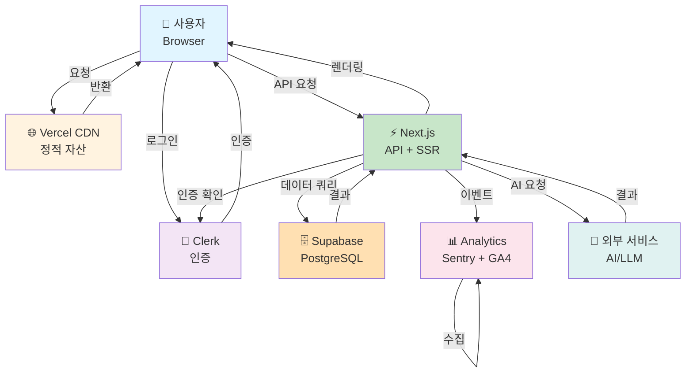

---

## 2. 데이터 흐름 (사용자 여정)

```mermaid
graph LR
    A["👤 사용자 방문"] --> B["🎯 Hero 섹션<br/>CTA 클릭"]
    
    B -->|인증 필요| C{"🔐 로그인<br/>여부"}
    
    C -->|미로그인| D["📝 회원가입<br/>Clerk"]
    C -->|로그인| E["🎮 데모 도구<br/>질문 3개"]
    
    D -->|✅ 가입 완료| E
    
    E --> F["🔄 데이터 제출<br/>API"]
    F --> G["🧠 AI 분석<br/>Supabase"]
    G --> H["📋 결과 표시<br/>상위 3개 상품"]
    
    H --> I{"👍 피드백<br/>제출"}
    I -->|Yes| J["💾 피드백 저장"]
    J --> K["📊 분석 기록"]
    
    I -->|No| K
    
    K --> L["💳 구독 제안<br/>요금제"]
    L --> M{"구독<br/>선택"}
    
    M -->|무료| N["✅ 무료 계정"]
    M -->|월간| O["💰 월간 구독<br/>Stripe"]
    M -->|연간| P["💰 연간 구독<br/>Stripe"]
    
    O --> Q["🎉 구독 완료"]
    P --> Q
    N --> Q
    
    Q --> R["🚀 대시보드<br/>접근"]
    
    style A fill:#e3f2fd
    style C fill:#fff9c4
    style D fill:#c8e6c9
    style E fill:#bbdefb
    style F fill:#ffe0b2
    style G fill:#f0f4c3
    style H fill:#c5cae9
    style I fill:#fff9c4
    style J fill:#c8e6c9
    style K fill:#b2dfdb
    style L fill:#ffccbc
    style Q fill:#a5d6a7
    style R fill:#81c784
```

---

## 3. 데이터베이스 ER 다이어그램

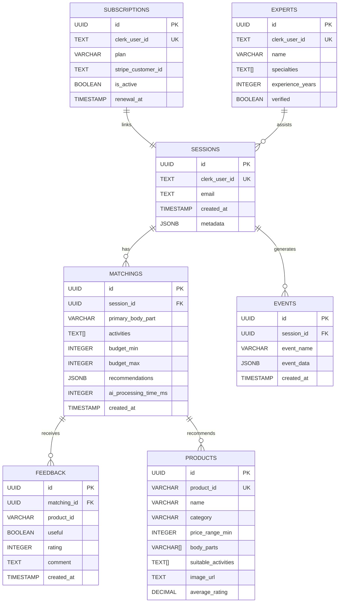

---

## 4. API 호출 흐름

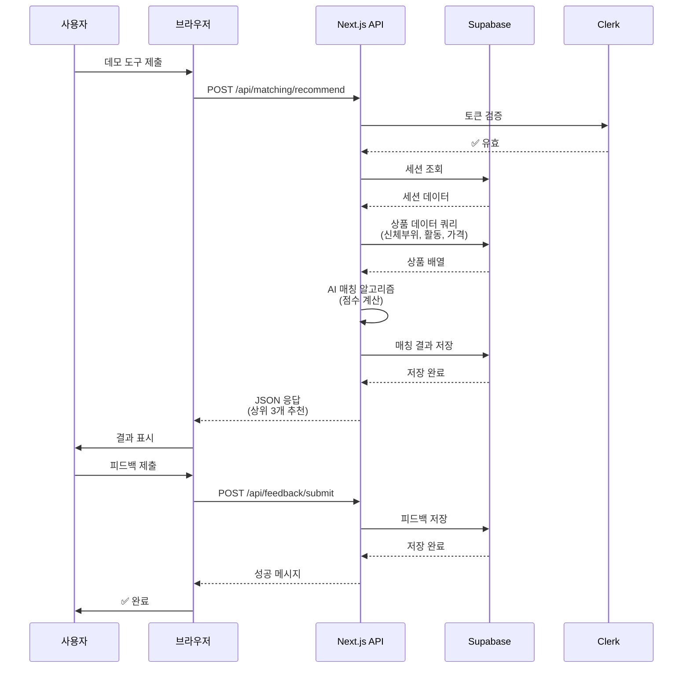

---

## 5. 인증 플로우 (Clerk)

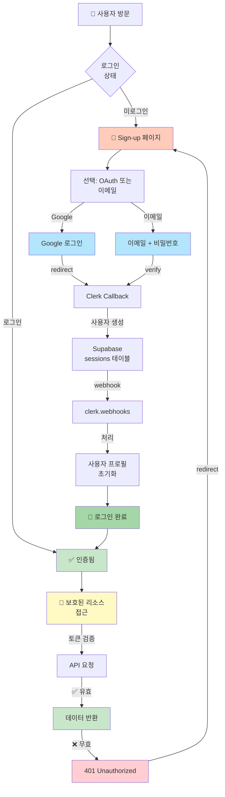

---

## 6. 배포 파이프라인

```mermaid
graph LR
    A["💾 Git Commit<br/>feature branch"] --> B["📤 Push to GitHub"]
    
    B --> C["🔍 GitHub Actions<br/>Trigger"]
    
    C --> D["🏗️ Build"]
    D --> E["🧪 Tests"]
    E --> F["📊 Lint"]
    
    F -->|모두 통과| G["✅ PR Created"]
    F -->|실패| H["❌ Build Failed<br/>알림"]
    
    G --> I["👥 Code Review"]
    I -->|승인| J["Merge to develop"]
    I -->|변경요청| K["수정 & 재검토"]
    
    K --> J
    
    J --> L["🚀 Deploy to<br/>Staging (Vercel)"]
    L --> M["📝 Preview URL"]
    
    M --> N{"금요일<br/>배포}
    
    N -->|주간 배포| O["Merge to main"]
    N -->|긴급| O
    
    O --> P["🚀 Deploy to<br/>Production"]
    P --> Q["🔄 Auto Rollback<br/>if Failed"]
    
    Q -->|성공| R["✅ Live"]
    Q -->|실패| S["🔙 Rollback<br/>이전 버전"]
    
    R --> T["📊 Monitor<br/>Sentry + GA4"]
    
    style A fill:#bbdefb
    style B fill:#90caf9
    style C fill:#64b5f6
    style D fill:#42a5f5
    style E fill:#2196f3
    style F fill:#1e88e5
    style G fill:#c8e6c9
    style J fill:#a5d6a7
    style L fill:#fff9c4
    style P fill:#ffe0b2
    style R fill:#c8e6c9
    style S fill:#ffcdd2
    style T fill:#b2dfdb
```

---

## 7. 상태 관리 (Zustand)

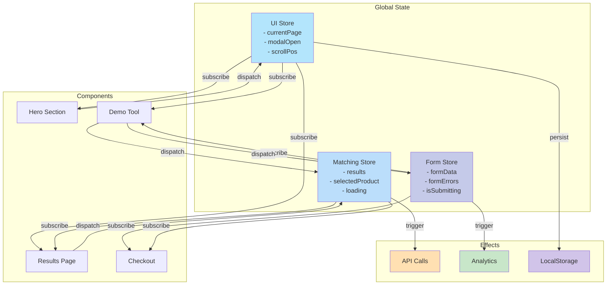

---

## 8. 에러 처리 플로우

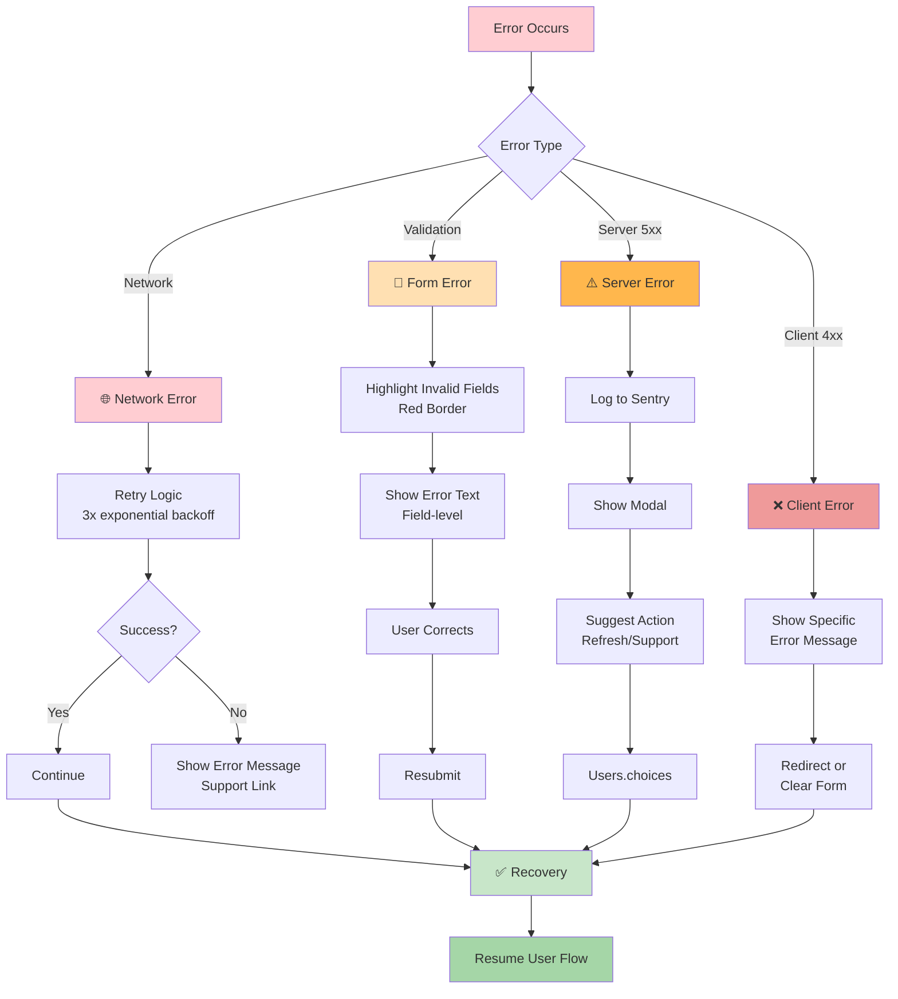

---

## 9. 성능 최적화 전략

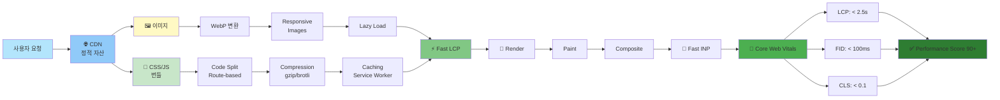

---

## 10. 모니터링 및 알림

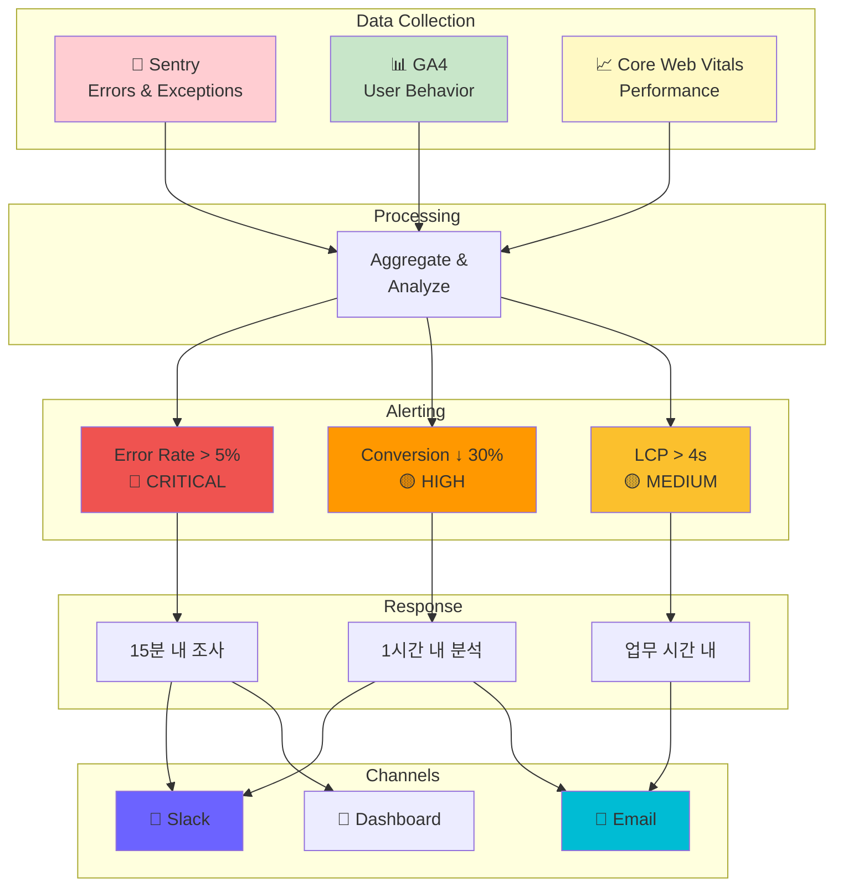

---

## 11. A/B 테스트 프로세스

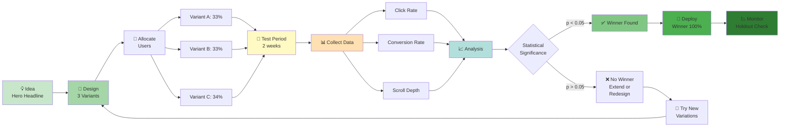

---

## 12. 마이크로 인터랙션 타이밍

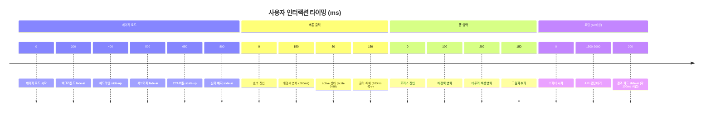

---

**다이어그램 사용 팁:**
- GitHub에서 렌더링됨 (.md 파일에서)
- Mermaid Live Editor: https://mermaid.live
- VSCode Mermaid 확장 설치 시 미리보기 가능
- 각 다이어그램 우측 상단의 ⋯ 메뉴에서 PNG/SVG 다운로드 가능

