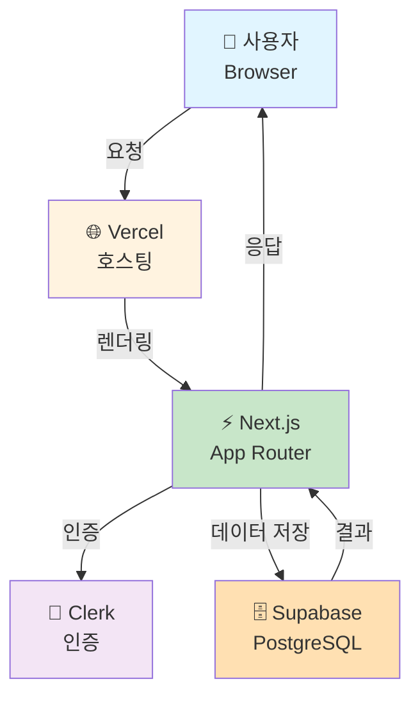
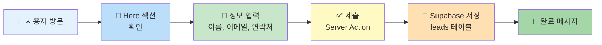
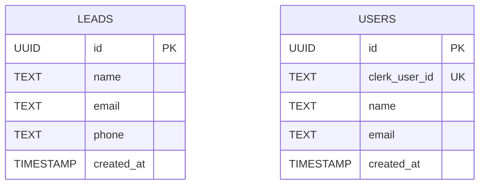
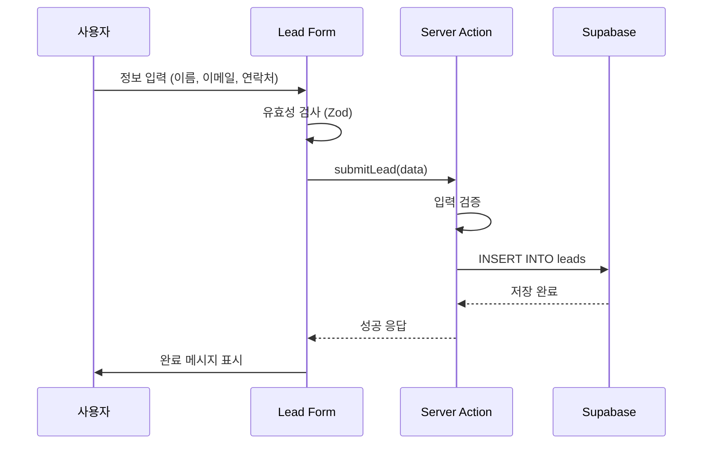
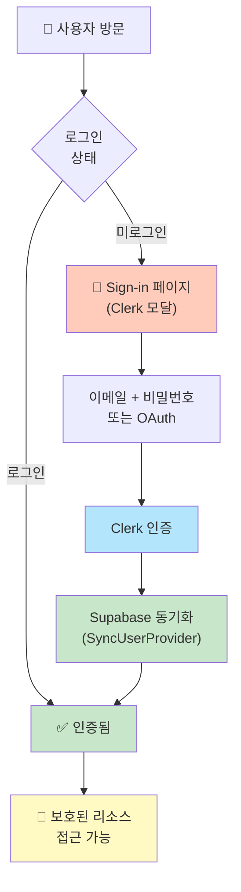
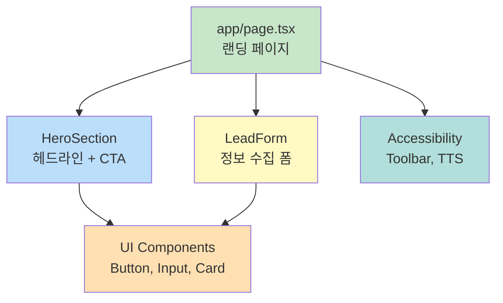

# Mermaid.md - 아키텍처 및 플로우 다이어그램

> 단순화된 랜딩페이지 아키텍처 다이어그램

---

## 1. 시스템 아키텍처

---

## 2. 사용자 여정 (단순화)

---

## 3. 데이터베이스 스키마

---

## 4. Server Action 흐름

---

## 5. 인증 플로우 (Clerk)

---

## 6. 컴포넌트 구조

---

**다이어그램 사용 팁:**
- GitHub에서 렌더링됨 (.md 파일에서)
- Mermaid Live Editor: https://mermaid.live
- VSCode Mermaid 확장 설치 시 미리보기 가능
